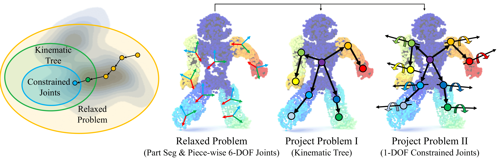
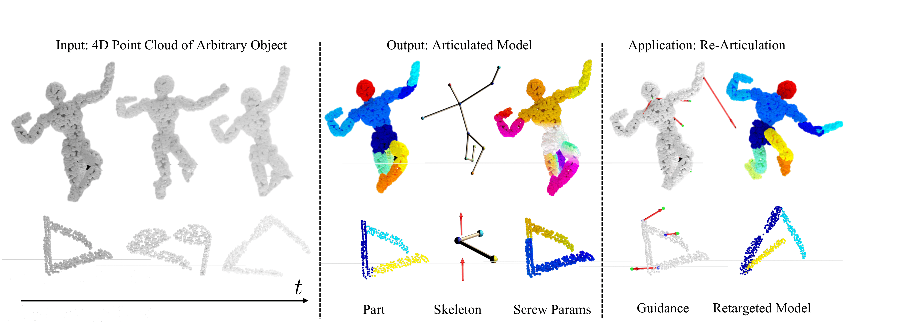
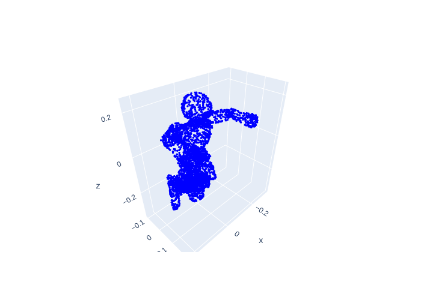
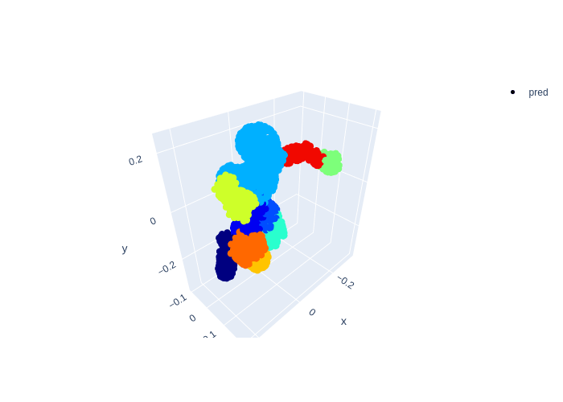
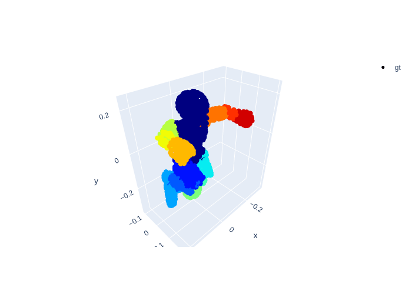

<!-- PROJECT LOGO -->
<br />
<p align="center">

  <h1 align="center">Building Rearticulable Models for Arbitrary 3D Objects from 4D Point Clouds </h1>

  <p align="center">
    
  </p>
  <p align="center">
    CVPR, 2023
    <br />
    <a href="https://stevenlsw.github.io"><strong>Shaowei Liu</strong></a>
    ·
    <a href="https://saurabhg.web.illinois.edu/"><strong>Saurabh Gupta*</strong></a>
    ·
    <a href="https://shenlong.web.illinois.edu/"><strong>Shenlong Wang*</strong></a>
    ·
  </p>

  <p align="center">
    <a href='https://arxiv.org/abs/2306.00979'>
      
    </a>
    <a href='https://stevenlsw.github.io/reart/' style='padding-left: 0.5rem;'>
      
    <a href='https://colab.research.google.com/drive/16-77HTfuniHwyc9XsvvP_7hyuilNWtjd' style='padding-left: 0.5rem;'></a>
    <a href='https://www.youtube.com/watch?v=Bdolp3FTZUc' style='padding-left: 0.5rem;'>
      
    </a>
  </p>
</p>
<br />

This repository contains a pytorch implementation for the paper: [Building Rearticulable Models for Arbitrary 3D Objects from 4D Point Clouds](https://arxiv.org/abs/2306.00979). In this paper, we build animatable 3D models from arbitrary articulated object point cloud sequence.<br><br>

## Overview



## Installation
- Clone this repository: 
    ```Shell
    git clone https://github.com/stevenlsw/reart
    cd reart
    ```
- Install requirements in a virtual environment:
    ```Shell
    sh setup_env.sh
    ```

The code is tested on Python `3.6.13` and Pytorch `1.10.2+cu113`.

## Colab notebook
Run our [Colab notebook](https://colab.research.google.com/drive/16-77HTfuniHwyc9XsvvP_7hyuilNWtjd) for quick start! 


## Demo

`demo_data` folder contains data and pretrained model of Nao robot. We provide two pretrained models, `base-2` is the relaxation model and `kinematic-2` is the projection model. Postfix `2` is the canonical frame index. Canonical frame index is selected by the lowest energy.

### Evaluate and visualization
Canonical frame index `cano_idx` should be consistent with postfix in pretrained model name.

- projection model
```Shell
python run_robot.py  --seq_path=demo_data/data/nao --save_root=exp --cano_idx=2 --evaluate --resume=demo_data/pretrained/nao/kinematic-2/model.pth.tar --model=kinematic
```

- relaxation model
```Shell
python run_robot.py  --seq_path=demo_data/data/nao --save_root=exp --cano_idx=2 --evaluate --resume=demo_data/pretrained/nao/base-2/model.pth.tar --model=base
```

After running the command, results are stored in `${save_root}/${robot name}`. `input.gif` visualize the input sequence, `recon.gif` visualize the reconstruction, 
`gt.gif` visualize the GT. `seg.html` visualize the pred segmentation, `structure.html` visualize the infered topology. `result.txt` contains the evaluation result. 

Input| Recon | GT
---|---|---
 |  | 


## Training

### Download data
Download the data from [here](https://drive.google.com/drive/folders/1P87A4nAktU8qUJICoAvoQCWp90YFY6ZG?usp=sharing) and save as `data` folder.
```
data
├──  robot
│     └── nao   - robot name
│     └── ...       
├──  category_normalize_scale.pkl  - center and scale of each category	
```

### Download pretrained model
Download pretrained models from [here](https://drive.google.com/drive/folders/1bu2-zg1KVt7nIBG_L9UVjQTwesZqDoPo?usp=sharing) and save as `pretrained` folder.
```
pretrained
├──  robot
│     └── nao   - robot name
│       └── base-{cano_idx}       - pretrained relaxation model			    
│       └── kinematic-{cano_idx}  - pretrained projection model  
├──  corr_model.pth.tar  - pretrained correspondence model
```

### Train relaxation model
`corr_model.pth.tar` is needed for training. Recommend set `cano_idx` same as our release pretrained model to get the reported performance for each category. 

```Shell
python run_robot.py --seq_path=data/robot/nao --save_root=exp --cano_idx=2 --use_flow_loss --use_nproc --use_assign_loss --downsample 4 --n_iter=15000
```
The relaxation results are stored at `${save_root}/${robot name}/result.pkl` and needed for training projection model.


### Train projection model

Set the relaxation result `base_result_path` as above.

```Shell
python run_robot.py --seq_path=data/robot/nao --save_root=exp --cano_idx=2  --use_flow_loss --use_nproc --use_assign_loss --model=kinematic --base_result_path=exp/nao/result.pkl --assign_iter=0 --downsample=2 --assign_gap=1 --snapshot_gap=10
```


## Citation

If you find our work useful in your research, please cite:

```BiBTeX
@inproceedings{liu2023building,
  title={Building Rearticulable Models for Arbitrary 3D Objects from 4D Point Clouds},
  author={Liu, Shaowei and Gupta, Saurabh and Wang, Shenlong},
  booktitle={Proceedings of the IEEE/CVF Conference on Computer Vision and Pattern Recognition},
  pages={21138--21147},
  year={2023}
}
```


## Acknowledges
We thank:
* [Watch It Move](https://github.com/NVlabs/watch-it-move.git) for MST implementation
* [APTED](https://github.com/JoaoFelipe/apted) for tree edit distance measure
* [KNN_CUDA](https://github.com/unlimblue/KNN_CUDA.git) for KNN with CUDA support
